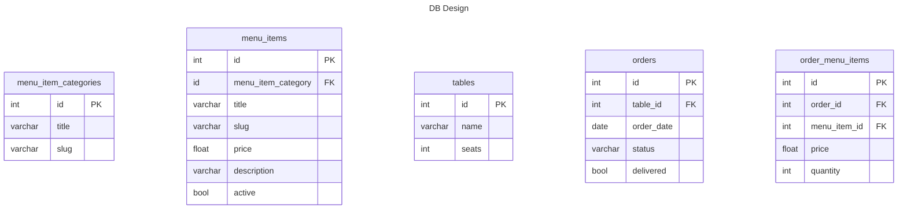

# Real-Time Web 2022 - 2023

## Table of Contents
- [Real-Time Web 2022 - 2023](#real-time-web-2022---2023)
  - [Table of Contents](#table-of-contents)
  - [Socket.io](#socketio)
    - [Wat is Socket.io?](#wat-is-socketio)
    - [Socket.io implementatie in het kort](#socketio-implementatie-in-het-kort)
    - [Setup](#setup)
    - [Emitting/listening](#emittinglistening)
      - [Join chat](#join-chat)
      - [Bericht versturen](#bericht-versturen)
      - [Bericht ontvangen](#bericht-ontvangen)
    - [Toepassing](#toepassing)
    - [DB Design](#db-design)
    - [Bronnen](#bronnen)

## Socket.io

### Wat is Socket.io?
Socket.io is een library die een vaste connectie maakt tussen de gebruiker(client) en de server. Dit gebeurt op een andere manier dan bijvoorbeeld een fetch request. Bij een fetch request maak je connectie tot een server en die server geeft dan informatie terug en daarna wordt die connectie afgesloten. Scoket.io maakt gberuik van websockets. Deze zorgen ervoor dat de communicatie tussen de client en de server open blijven. Dit is dus wat je wilt hebben wanneer je bepaalde data gelijk wilt doorsturen naar de client, zonder dat de client zijn browser hoeft te refreshen. Wij gaan socket.io dus gebruiken voor onze chatfunctie.

### Socket.io implementatie in het kort
Wanneer je socket.io toepast in je project, zijn er verschillende manieren om data te versturen naar gebruikers. Je zou iets kunnen versturen naar: alle users die de applicatie gebruiken, alle users exclusief jezelf, alle users die een bepaalde room/rooms zijn gejoind en naar een specifieke user aan de hand van de socketId.

Het laatste heb ik we geprobeerd, maar helaas heb ik dit niet werkend gekregen, omdat ik tot nu toe geen manier heb gevonden om access te krijgen tot de session waar de user zich bevind. Want op die manier zou ik de socketId in een array plaatsen als value en de ingelogde user als property name, zodat als ik die persoon een bericht wilde sturen ik altijd de goede socketId zou hebben, maar dit heb ik dus helaas niet werkend gekregen.

Wel heb ik het op een andere manier opgelost. Wanneer er een nieuwe chat wordt aangemaakt, krijgt deze een standaard naam(de username van de chatter en de username van de ingelogde user). Wanneer je de chat opent, join je automatisch een socket room met de naam van de geopende chat. En hetzelfde geldt voor de ander gebruiker. En omdat jullie dezelfde room zijn gejoind is het dus mogelijk om realtime berichten naar elkaar te sturen.

### Setup
Om gebruik te maken van socket.io moet er eerst ```npm install socket.io``` gerund worden.
Om socket.io te initialiseren, moet deze required worden in de server js en daarna een http server opgezet worden, zodat hier naar geluisterd kan worden. in de io.on('connection') kunner er dus bepaalde triggers aangemaakt worden die functies uitvoeren.

```js
import express from 'express';
import http from 'http';
import { Server } from 'socket.io';
const app = express();
const server = http.Server(app);
const io = new Server(server);
io.on('connection', socket => {
    console.log('a user connected');
})

```
Na het opzetten van je socket server moert deze ook aan de frontend toegevoegd worden

```html
<script src="/socket.io/socket.io.js"></script>
<script>
    const socket = io();
</script>
```

### Emitting/listening
Om de backend met de frontend te laten communiceren via socket, moet je bij de backend en frontend emits en listeners hebben.

#### Join chat
Wanneer je de chat opent, haalt hij de chatname uit de hidden input en dan wordt de emit "join-chat" uitgevoerd met de value van de chatname

**Frontend**
```js

let chatName;
if(messageForm){
    chatName = document.getElementById('chatName').value;
    socket.emit('join-chat', chatName);
}
```

**Backend**
```js
io.on('connection', socket => {
    socket.on('join-chat', (name) => {
        socket.join(name);
    });
})
```

#### Bericht versturen
Als de submitForm functie wordt uitgevoerd, wordt de emit "new-msg-sent" uitgevoerd met de value van de chatname en het bericht. En daarna wordt het bericht wat jij hebt verstuurd aan de rechterkant toegevoegd onder aan de lijst.

**Frontend**
Het bericht wordt verstuurd en emitted.
```js
const submitForm = async(e) => {
    e.preventDefault();
    const form = new FormData(messageForm);
    const msg = form.get("message").trim();
    if(msg.length){
        await socket.emit('new-msg-sent', {
            name: chatName,
            msg: msg,
        });
        addMessage(msg, 'sender')
        messageForm.reset();
    }
}
```

**Backend**
Het bericht wordt ontvangen en doorgestuurd naar de chatroom.
```js
io.on('connection', socket => {
    socket.on('join-chat', (name) => {
        socket.join(name);
    })

    socket.on('new-msg-sent', chat => {
        socket.to(chat.name).emit('new-msg', chat.msg);
    })
})

```

#### Bericht ontvangen
Nadat het bericht verstuurd is word er gelistned naar de "new-msg" event, zodat deze de message kan toevoegen aan de chat container.
**Frontend**
```js
socket.on('new-msg', message => {
    if(chatContainer){
        addMessage(message, 'receiver', false);
    }
})
```

### Toepassing
Ik ga socket.io gebruiken om een restaurant order systeem te maken. Wanneer een host, runner of waiter een order plaatst, moet deze order direct zichtbaar zijn voor de keuken, zonder dat het scherm opnieuw geladen moet worden. Dit is dus een perfecte toepassing voor socket.io.


### DB Design


### Bronnen
- https://socket.io/get-started/chat
- https://tsh.io/blog/socket-io-tutorial-real-time-communication/
