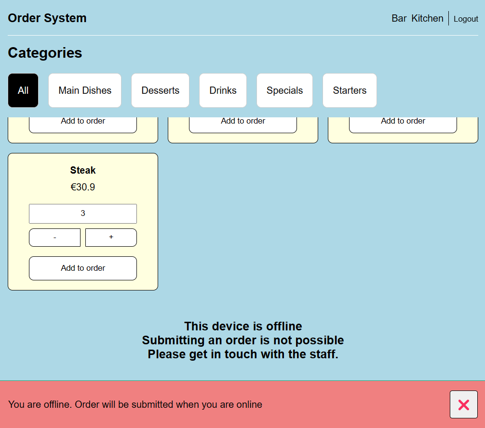

# Real-Time Web 2022 - 2023

## Table of Contents
- [Real-Time Web 2022 - 2023](#real-time-web-2022---2023)
  - [Table of Contents](#table-of-contents)
  - [Demo](#demo)
  - [Installation](#installation)
    - [Clone](#clone)
    - [Setup](#setup)
    - [API](#api)
    - [Development Server](#development-server)
    - [Production](#production)
  - [Restaurant Order App](#restaurant-order-app)
    - [Nuxt 3](#nuxt-3)
    - [Backend](#backend)
      - [Supabase](#supabase)
      - [Authentication](#authentication)
      - [Tables](#tables)
      - [Realtime](#realtime)
      - [API routes](#api-routes)
      - [Queries](#queries)
      - [Middleware](#middleware)
    - [Frontend](#frontend)
      - [Routes and Views](#routes-and-views)
      - [Public/Private pages](#publicprivate-pages)
      - [Apply Middleware](#apply-middleware)
      - [Reusable components](#reusable-components)
      - [OrderMenuItems](#ordermenuitems)
      - [Toast](#toast)
      - [Realtime Channel](#realtime-channel)
  - [Results](#results)
    - [Loading screen](#loading-screen)
    - [Home](#home)
    - [Orders: Kitchen/Bar](#orders-kitchenbar)
    - [Login](#login)
  - [Bronnen](#bronnen)

## Demo
The demo can be found [here](https://real-time-web.netlify.app/).
Some pages need authentication to be viewed.

You can login on page `/login`.
The login credentials are:
- email: `admin@food.nl`
- password: `test123`

## Installation

### Clone
The first step is to clone this repository:

```bash
git clone https://github.com/WyroneBlue/real-time-web-2223.git
cd real-time-web-2223
```

### Setup

Make sure to install the dependencies with your favorite package manager:

```bash
# yarn
yarn install

# npm
npm install

# pnpm
pnpm install --shamefully-hoist
```

### API
After installing all the dependencies you need to create an account on [supabase](https://supabase.com). After you created an account you need to create a project. After you created a project you need to go to the settings of your project and go to the `API` tab. In this tab you can find the `URL` and `Key` of your project.

You need to copy these values and create a `.env` file in the root of the project. In this file you need to add the following values:

```env
SUPABASE_URL=[past url here]
SUPABASE_KEY=[past key here]
```

!!! note ENV
    You van copy the .env.example file and rename it to .env and the fields will already be there

### Development Server

Start the development server on http://localhost:3000

```bash
npm run dev
```

### Production

Build the application for production:

```bash
npm run build
```

Locally preview production build:

```bash
npm run preview
```

Check out the [deployment documentation](https://nuxt.com/docs/getting-started/deployment) for more information.

## Restaurant Order App
For this course I'm going to make a restaurant order app. The idea is that you can order food from your table and that the people in the kitchen and the bar can see the order popup on their screen in real time. The staff(waiter/kitchen/bar) can also change the status of the order. The application also has authentication, so that only the staff can see the orders and change the status of the orders.

To create this application i will be using a fullstack framework called [nuxt](https://nuxt.com), which will be responsible for the views and (api)routes and listening for real time events, and a postgres database called [supabase](https://supabase.com) which will be responsible for saving the orders, users and other data.

### Nuxt 3
The reason why i chose to use nuxt 3 is because it's a fullstack framework. It has a frontend and a backend. The frontend is build with vue and the backend is build with node like server called nitro. This means that i can use the same language for both the frontend and the backend.

### Backend

#### Supabase
Supabase is a postgres database with a lot of extra features. It has authentication, realtime events, storage and more. I'm going to use supabase for the authentication and the realtime events. The realtime events are going to be used to send the orders to the kitchen and the bar screens in realtime.

#### Authentication
To enable authentication within supabase you need to make sure the right provider is activated in the settings. For this application i'm going to use the email provider. This means that the user has to create an account with their email and password. To enable this provider you have to go to the settings of your project and go to the `Authentication` tab. In this tab you can enable the email provider.


After you enabled the email provider you can create a user by going to the `Users` tab and click on the `Create user` button. After you created a user you can login with the email and password you just created.


#### Tables

To create the tables for this application i'm going to use the supabase dashboard. In the dashboard you can create tables and columns. I'm going to create the following tables:


#### Realtime
To enable realtime events you have to go to the `Realtime` tab in the settings. In this tab you can enable the realtime events.


#### API routes
To create api routes within nuxt 3 you have to create a folder named api in the server folder. In this folder you can create a file with the name of the route you want to create. For example if you want to create a route called `orders` you have to create a file called `orders.js`. In this file you need a function called `defineEventHandler` which is going to be the handler for the route.
For example:
```js
export default defineEventHandler(async (event) => {

    return {
        status: 200,
        data: []
    };
});
```

You can also specify the request method by adding it to the filename. For example if you want to create a `POST` route you have to create a file called `orders.post.js`. if you want ot get the data from the request you can use the `readBody` function and pass the event to it.
For example:
```js
export default defineEventHandler(async (event) => {

    const { order, tableNumber } = await readBody(event);
    console.log('tableNumber', tableNumber);
    console.log('order', order);
    return {
        status: 200,
        data: []
    };
});
```

#### Queries

!!! warning Policies
    Before you can make queries to the database you have to create a policy for each table and for each action you want to do to that table. You can add policies by going to the edit table section and go to the `Policies` tab.
    
    


To make queries to the database you can use the `@nuxtjs/supabase` package. This package is made by supabase and is the official package to make queries to the database. After you import the package you can use the `supabaseClient` function to create a client. This function takes an event as an argument. This event is the request event. After you created the client you can make queries to the database.
For example:
```js
import { serverSupabaseClient } from '#supabase/server'

export default defineEventHandler(async (event) => {
    const supabase = serverSupabaseClient(event);

    try {
        const { data: orders, error } = await supabase
        .from('orders')
        .select(`*`)
        .order('created_at', { ascending: true })

        console.log('error', error);
        return {
            status: 200,
            data: orders
        };
    } catch (error) {
        console.log(error);
        return {
            status: 500,
            data: error
        };
    }
});
```

!!! note Relations
    To get the relations you have to add the `select` function to the query. For example if you want to get the menu items from an order you have to add `select('*, menu_items(*)')` to the query.


Now you can make request to the endpoint you just created. For example if you created a `POST` route called `orders` you can make a request to `http://localhost:3000/api/orders` with the data you want to send in the body of the request.

#### Middleware
To setup the middleware i first have to create a middleware folder in the root of the project. In this folder i created a file called `auth.js`. In this file i'm going to check if the user is logged in. If they are, they can see the page, if they aren't they will be redirected to the home page.

```js
export default defineNuxtRouteMiddleware((to, _from) => {
    const user = useSupabaseUser()
    if (!user.value) {
        return navigateTo('/')
    }
})
```

After creating the new middleware you have to apply it in your vue page. more baout that in [Apply middleware](#apply-middleware)

### Frontend


#### Routes and Views
Creating the routes and views in a nuxt application is very simple. The only thing you have to do is create a folder called `pages` in the root of the project. In this folder you can create a file with the name of the route you want to create. For example if you want to create a route called `orders` you have to create a file called `orders.vue`. In this file you can create the view for the route.

For example:
```html
<script setup>
</script>
<template>
    <section>
        <h1>Orders</h1>

        <!-- List -->
    </section>
</template>
```

Now you can navigate to the route you just created. For example if you created a route called `orders` you can navigate to `http://localhost:3000/orders`.

#### Public/Private pages
The application consists of 4 different pages and 2 layout. A layout for the login page and a layout for the rest of the pages.
The pages are:
- Login
- Home/Order form
- Kitchen orders view
- Bar orders view

The login page is a public page, so you don't have to be logged in to see it. The same goes for the order form page. The order view pages(Kitchen/Bar) are private pages, so you have to be logged in to see them.

To make sure that the user is logged in before they can see the private pages, i'm going to use a middleware. This middleware is going to check if the user is logged in and if they are, they can see the page, if they aren't they will be redirected to the home page.

#### Apply Middleware
To apply the middleware you created from your backend to a page you have to add the `middleware` property to the page. For example if you want to apply the `auth` middleware to the `orders` page you have to add the following code to the `orders.vue` file.

```html
<script setup>
definePageMeta({
    middleware: "auth",
});
</script>
```

This will make sure that the user is logged in before they can see the page.

#### Reusable components
An important part of the application is the reusable components. These components are used on multiple pages.

#### OrderMenuItems
For example the `OrderMenuItems` and the `OrderStatusList` components are used on the `Kitchen` and `Bar` pages. To make sure that the components are reusable i'm going to use the `defineProps` function. This function makes it possible to pass data to a child component from the page where the component is used.

For example
```html

<!-- /pages/orders/bar.vue -->
<script setup>
    const state = reactive({
        orders: [],
        channel: null,
    });

    const fetchOrders = async () => {
        const { data } = await useFetch('/api/orders/bar');
        state.orders = data.value?.data;
    };
</script>

<template>
    <section>
        <h1>Bar</h1>
        <OrderMenuItems :orders="orders" />
    </section>
</template>
```

```html

<!-- /components/OrderMenuItems.vue -->
<script setup>

const props = defineProps({
    orders: {
        type: Array,
        required: true,
    },
});
</script>

<template>
    <ul>
        <li v-for="order in orders" :key="order.id">
            <h2>{{ order.name }}</h2>
            <ul>
                <li v-for="item in order.menu_items" :key="item.id">
                    <p>{{ item.name }}</p>
                </li>
            </ul>
        </li>
    </ul>
</template>
```

!!! warning Types
    When you use the `defineProps` function you have to make sure that you use the correct types. For example if you want to pass an array to the child component you have to use the `Array` type. If you don't use the correct type you will get an error.

#### Toast
I also made a component for the toast messages. This component is used to show the user a message when they have successfully placed an order or when something has gone wrong. This component is also reusable, because it is used on all pages. When i call the function `useSetToast` in a page, the toast component will show the message.

For example:
```html
<!-- main layout -->
<template>
    <main>
        <slot />
    </main>

    <!-- Toast message will be place here -->
    <ToastMessage />
</template>
```

```html
<!-- main layout -->
<script setup>
const fetchFoods = async () => {
    const { data: menu_items, error } = await useFetch('/api/menu-items', {
        key: 'menu-items',
    });

    if(error.value) {
        useSetToast({
            type: 'error',
            msg: 'Failed to load menu items. Please get in touch with the staff.'
        })
    }

    ...
}
</script>
```

#### Realtime Channel

!!! warning Enable Realtime
    Before setting up the realtime channel, make sure the realtime option is enabled like [shown here](#realtime)
When you want to actively listen to changes in your database you can use the `channel` function. This function makes it possible to listen to changes in your database.


For example:
```js

<script setup>
const client = useSupabaseClient()
const state = reactive({
    orders: [],
    channel: null,
});

const fetchOrders = async () => {
    const { data } = await useFetch('/api/orders/bar');
    state.orders = data.value?.data;
};

onMounted(() => {
    state.channel = client.channel('public:orders')
        .on('postgres_changes',
            { event: '*', schema: 'public', table: 'orders' },
            () => fetchOrders()
        )
        .subscribe();

});

onUnmounted(() => {
    client.removeChannel(state.channel)
});
</setup>
```

!!! warning Leave channel
    Make sure to also leave the channel when the component is unmounted.

## Results

### Loading screen
| Loading screen 1 | Loading screen 2 |
| ---------------- | ---------------- |
|  |  |

### Home

| Initial | Loading items | Item picked |
| ------- | --------------| ----------- |
|  |  |  |


| Order success | No connection |
| ------------- | ----------- |
|  |  |


### Orders: Kitchen/Bar
| Initial | Orders loaded | No connection |
| ------- | --------------| ------------- |
|  |  |  |


### Login
| Initial | Login error |
| ------- | ----------- |
|  |  |

## Bronnen
- [Nuxt 3](https://nuxt.com/docs)
- [Supabase](https://supabase.com/docs/reference/javascript/update)
- [Nuxt supabase: realtime](https://supabase.nuxtjs.org/usage/composables/use-supabase-client/#realtime)